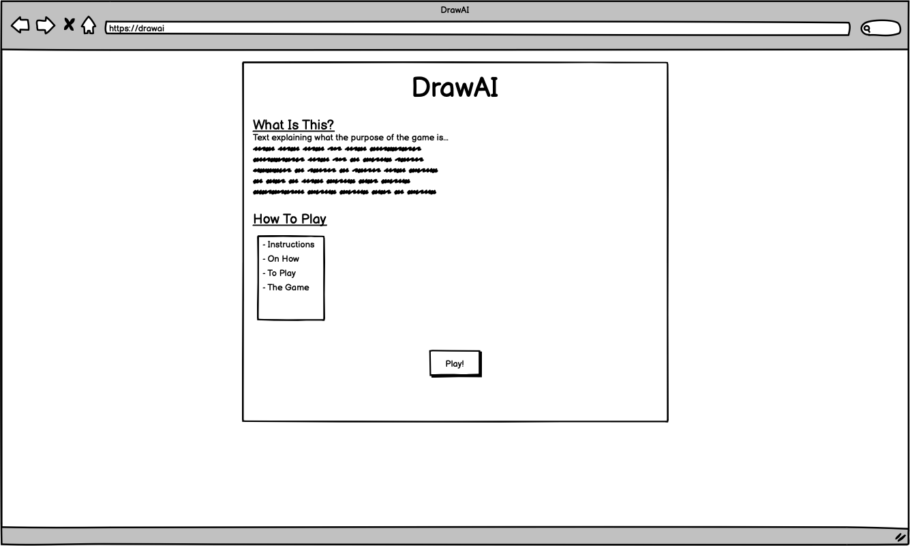
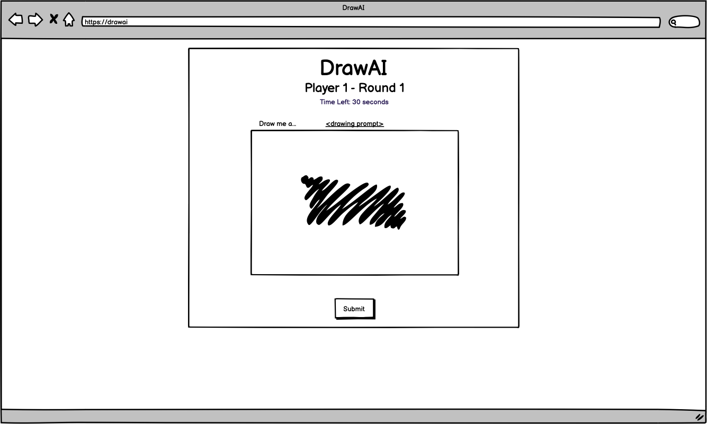
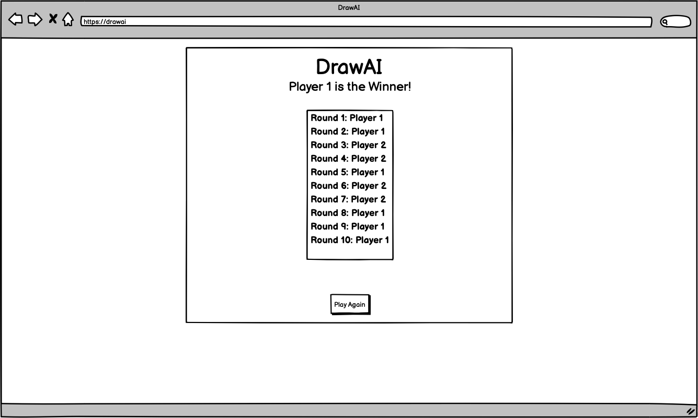

# Draw vs. Me
 > **Nitish Dayal** - Web and Mobile Applications Developer  
 > **Last commit date:** November 2nd, 2020

# About
See if you're the better artist! Play 1v1 against a friend to draw a given prompt; whichever drawing the computer can recognize as the given prompt gets a point. Whoever has the most points after 10 rounds, wins!

# MVP
* An in-browser game that has local 2-player support
* Fully fleshed out base game logic:
  * Players are given a prompt
  * Players can draw on a canvas
  * Drawing from canvas is converted to image format
  * Converted drawing is sent to image recognition API
  * Response from image recognition API should contain 'tags'; parse through tags to see if a word matches the prompt
  * Player is rewarded a point if a match is found in the tags
  * Game ends after 10 rounds
* 'High scores' saved on local storage

## Stretch Goal
* Move from in-browser to desktop app via Electron
* Support local and online multiplayer
* Allow for online multiplayer communication via templated chat message
* Global leaderboard
* Logic handling a scenario in which there is a draw
  * Options:
    1. **'Final Round'** - One more round to break the tie
    1. **'Rapid Fire'** - 3 more rounds on a shorter time span
    1. **'Coin Flip'** - Just flip a coin

## SUPER Stretch Goal
* User registration
* Tag-to-prompt matching that accounts for synonyms, ie. if the prompt is 'train' and the image recognition API returns 'locomotive', that should still reward a point

# Technologies
## MVP
* HTML/CSS/JS
* Image recognition API: [Google Vision AI](https://cloud.google.com/vision/)
* CSS framework: [Bulma](https://bulma.io)
## Stretch Goal
* [Electron](https://bulma.io) - Convert to desktop
* [Socket.io](https://socket.io) - Chat-based 
* [Firebase Firestore](https://firebase.google.com/products)
* [Firebase Cloud Function](https://firebase.google.com/products)
## SUPER Stretch Goal
* [Auth0](<https://auth0.com>)

# MVP Wireframes

## Landing Page

## Main Game

## Main Game

